# My-Simple-OpenGL

## Project Description
The project intends to build a small but useful graphics library which supports multiple rendering operations.  Rendering pipeline includes coordinate transformation, shading, texture mapping and rasterization.  

To initialize the renderer, parameters are passed to it with different markers. With the help of markers, renderer can identify what the data is for and assign it to corresponding class variables. More details can be found in `gz.h`.  

| Markers | Values |
|--|--|
| GZ_INTERPOLATE | Shading mode. This can be GZ_COLOR (Gouraud Shading) or GZ_NORMALS (Phong Shading).|
| GZ_TEXTURE_MAP | Texture function. Either a procedural texture or image mapping is ok. |
| GZ_POSITION | Vertex position in (triangle) meshes. |
| GZ_NORMAL | Mesh normals. |
| GZ_TEXTURE_INDEX | Vertex uv values in texture. |
 
##  Environment
- Windows 10  
- Visual Studio 2017  

## Coordinate Transformation
After initialization, the renderer will apply transformation matrix for vertex, normal and uv. However, the process of the three values differs. The stack for vertex records all the transformation matrices and moves model space positions to screen space. The stack for normal only records rotations as transition and scaling have no effect. For uv values, we have to interpolate it in perspective space and then move it to screen space. 

## Shading
2 shading methods are implemented in the project.  
- Gouraud Shading: For the primitive pairs, calculate the vertices color and apply interpolation for the points inside the shape.
-  Phong Shading: For the primitive pairs, apply normals interpolation for points inside the shape. Then calculate their color using the normal.

## Rasterization
Rasterization can be done in several ways. Scan Lines (also known as [DDA](https://en.wikipedia.org/wiki/Digital_differential_analyzer_(graphics_algorithm))) and LLE (Linear Expression Evaluation) are common ways of rasterization. Here implements LEE using the class defined in `LEE.h` file.

## MFC User Interface
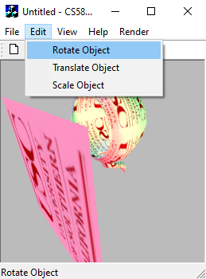 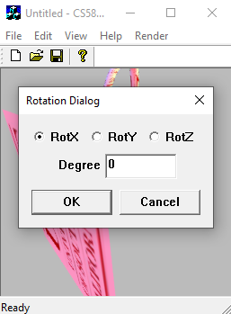   
Users can also change shading and texture options in `Application5.cpp`  
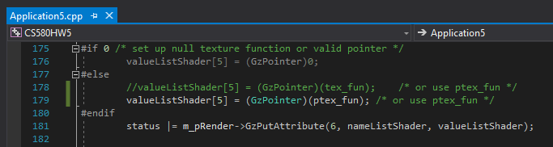  

## Results
> All images below are the results after anti-aliasing.   

    User Set Camera with/without Texture 
  

| Shading Mode | No Texture | Image Texture | Procedural Texture |
|--|--|--|--|
| Gouraud |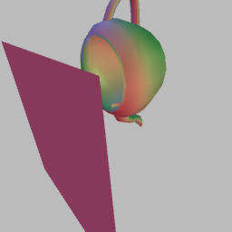|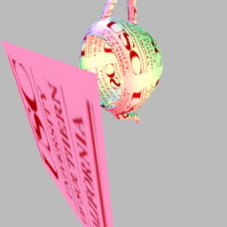||
| Phong |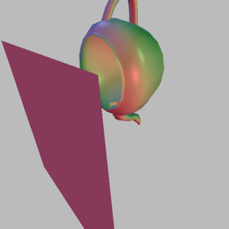|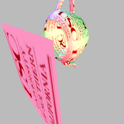|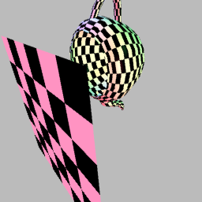|

    45 Degree Rotation in XYZ Axis 
  

| Shading Mode | X Axis| Y Axis| Z Axis|
|--|--|--|--|
| Gouraud |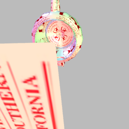|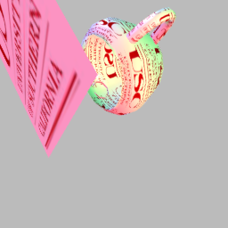|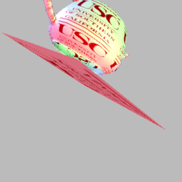|

    1.5 Translation in XYZ Axis 
  

| Shading Mode | X Axis| Y Axis| Z Axis|
|--|--|--|--|
| Gouraud |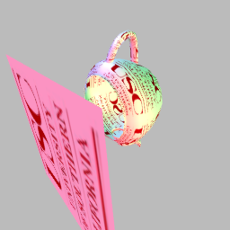|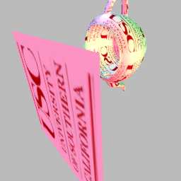|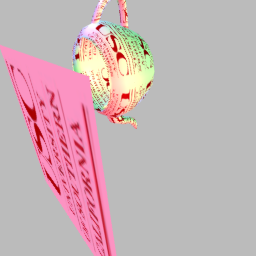|

    1.5 Scaling in XYZ Axis 
  

| Shading Mode | X Axis| Y Axis| Z Axis|
|--|--|--|--|
| Gouraud |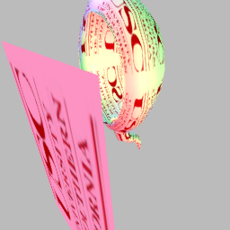|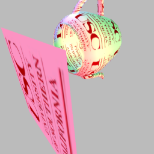|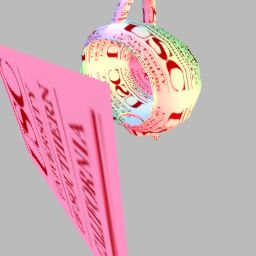|
