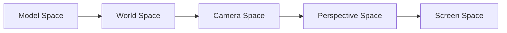

# My-Simple-OpenGL

## Project Description
The project intends to build a small but useful graphics library which supports multiple rendering operations.  Rendering pipeline includes coordinate transformation, shading, texture mapping and rasterization.  

To initialize the renderer, parameters are passed to it with different markers. With the help of markers, renderer can identify what the data is for and assign it to corresponding class variables. More details can be found in `gz.h`.  

| Markers | Values |
|--|--|
| GZ_INTERPOLATE | Shading mode. This can be GZ_COLOR (Gouraud Shading) or GZ_NORMALS (Phong Shading).|
| GZ_TEXTURE_MAP | Texture function. Either a procedural texture or image mapping is ok. |
| GZ_POSITION | Vertex position in (triangle) meshes. |
| GZ_NORMAL | Mesh normals. |
| GZ_TEXTURE_INDEX | Vertex uv values in texture. |
 
##  Environment
- Windows 10  
- Visual Studio 2017  

## Coordinate Transformation

After initialization, the renderer will apply transformation matrix for vertex, normal and uv. However, the process of the three values differs. The stack for vertex records all the transformation matrices. The stack for normal only records rotations as transition and scaling have no effect. // TODO: uv values transformation

## Results
| Shading Mode | No Texture | Image Texture | Procedural Texture |
|--|--|--|--|
| Gouraud ||||
| Phong ||||
